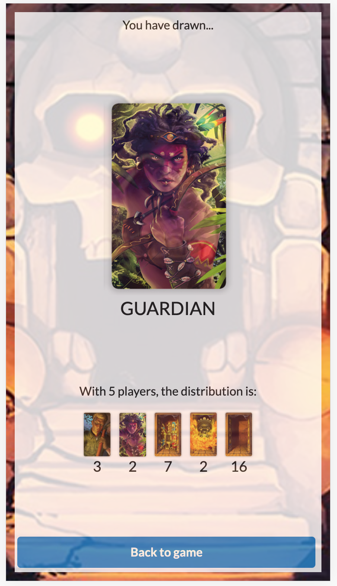
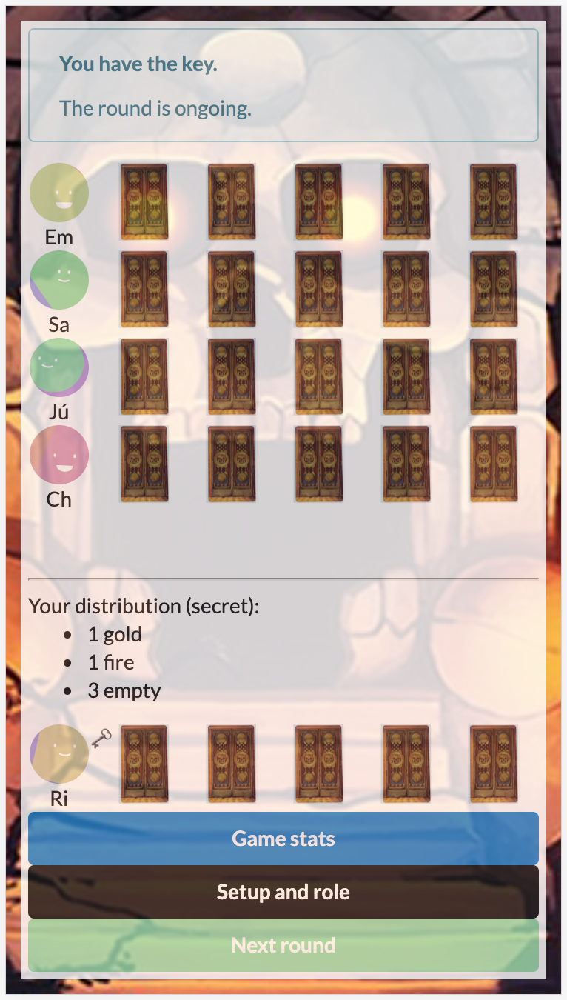
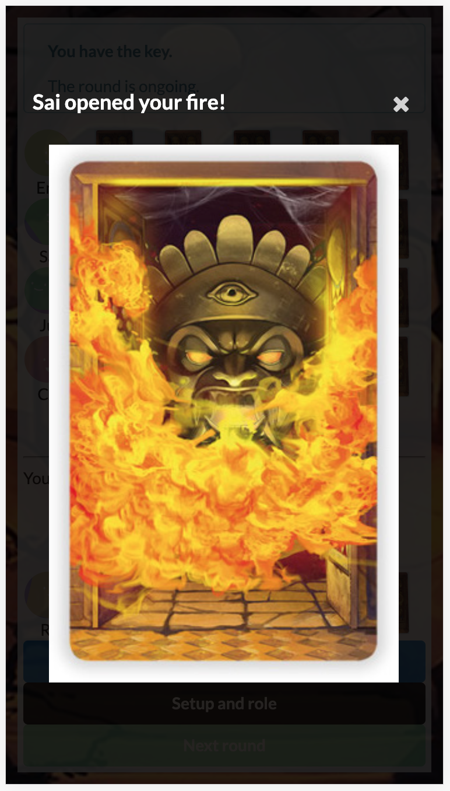
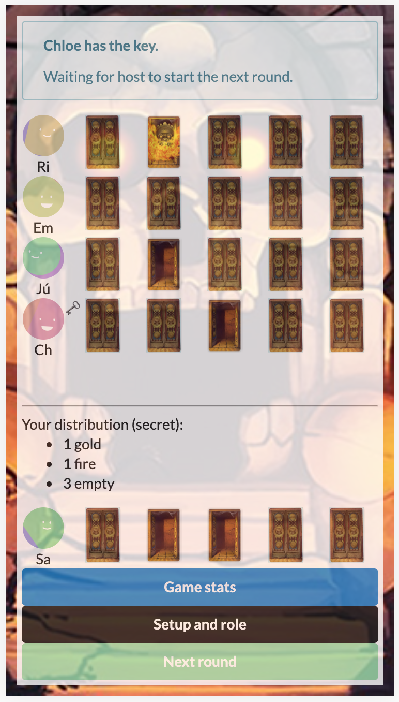

# Tempel des Schreckens

  
  
  
  

This is a web app implementation of the game, [Tempel des Schreckens](https://www.spiel-des-jahres.de/en/games/tempel-des-schreckens/) *(English: 'Temple of Terrors')*.

- [Game rules](RULES.md)

> A group of adventurers sets off in search of the legendary treasure of a mysterious jungle temple. But no-one banked on the guardians, who will try and prevent the gold and jewels of their ancestors being stolen – at any cost! To that end, they have hidden deadly fire-traps in the temple.
> 
> Both sides are faced with the problem that in the shadowy ruins of the temple, it’s too dark to tell friend from foe. The card game “Tempel des Schreckens” recreates this by giving out hidden roles at the start, so that no-one can be sure who’s on their team. Players stumble on in the dark, accompanied by accusations, assumptions and arguments.
> 
> This is a game whose real enjoyment comes from the lies and bluffs from all sides.

The client app can be used to facilitate playing either in groups or over a remote call.