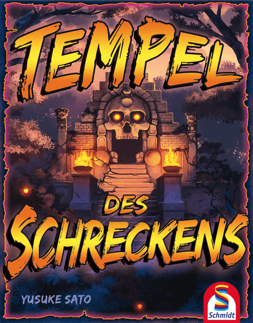

# Rules

> 🇩🇪 *Tempel des Schreckens* has official rules that only exist in German - so my understanding of the game is significantly indebted to [this unofficial English translation](https://boardgamegeek.com/filepage/139993/tempel-des-schreckens-unofficial-rules-english) of the rules.

**Welcome to the *Tempel des Schreckens*!**

## Thematic setup

For decades, rumours have spread about a hidden temple of great treasures... and grave terrors.

A foolhardy group of **Adventurers** have stumbled across it - and now they're ready to ransack it for all that it's worth.

However, some mysterious Temple **Guardians** have been awoken from their slumber, stirred to protect the treasures within.

Can the Adventurers find all the temple's gold in time? Or will they be led astray by the Guardians - into deadly traps of fire, or sealed within the temple for all eternity?