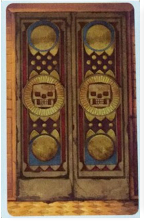
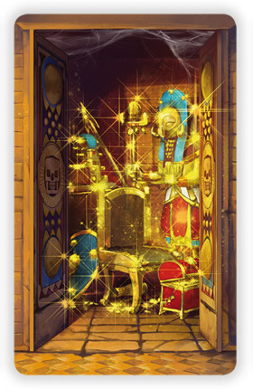
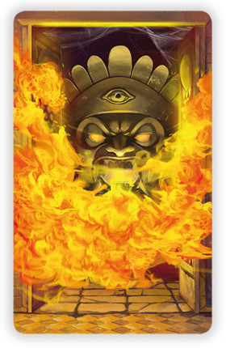
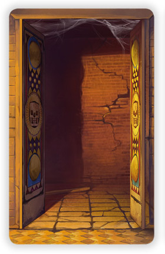

# Rules

> 🇩🇪 *Tempel des Schreckens* has official rules that only exist in German - so my understanding of the game is significantly indebted to [this unofficial English translation](https://boardgamegeek.com/filepage/139993/tempel-des-schreckens-unofficial-rules-english) of the rules.

**Welcome to the *Tempel des Schreckens*!**

- [Thematic setup](#thematic-setup)
- [Roles and win conditions](#roles-and-win-conditions)
- [Game mechanics](#game-mechanics)

## Thematic setup

For decades, rumours have spread about a hidden temple of great treasures... and grave terrors.

A foolhardy group of **Adventurers** have stumbled across it - and now they're ready to ransack it for all that it's worth.

However, some mysterious Temple **Guardians** have been awoken from their slumber, stirred to protect the treasures within.

Can the Adventurers find all the temple's gold in time? Or will they be led astray by the Guardians - into deadly traps of fire, or sealed within the temple for all eternity?

## Roles and win conditions

### Hidden roles and teams

In *Tempel des Schreckens*, **roles are always secret**. You know your role, but you don't know anybody else's role - and so you don't know who is, or who is not, on your team.

But, like a lot of hidden role games, there is a large *social deduction* element of trying to identify who is on which team.

There are exactly **two teams**: Adventurers and Guardians.
- *Teams are in direct competition* - every game always has a single winning team.
- *Teammates are non-competitive* - when a team wins, all of its members win together.

### Team win conditions

The two teams have different win conditions, which are directly opposed to each other.

The **Adventurer** team wins in only one way: if all of the temple's **Gold** is opened within four rounds.

The **Guardian** team wins in one of two ways:
1. If four rounds pass to completion *without* all of the Gold being located; or
2. If, at any time, all of the temple's **Fire** traps are opened.

The exact numbers on each team depends on the number of players, but there are almost always more Adventurers than Guardians.

The game ends in three ways:
1. *All Gold has been opened* - Adventurers win
2. *All Fire has been opened* - Guardians win
3. *Four rounds are complete* - Guardians win

There is always a winning team at the end of the game.

### Basic team dynamics

Adventurers are in a race against time to find all the Gold before the end of four rounds. They will try to cooperate with each other and share information to help them locate the Gold.

Guardians will typically obstruct this by *pretending* to be Adventurers (remember: roles are secret), and spreading misinformation, with two methods of obstruction (non-mutually exclusive):
- *Luring:* leading Adventurers into dangerous Fire traps
- *Stalling:* leading Adventurers down rabbit holes so that time runs out

However, if Guardians aren't subtle, Adventurers may be able to *deduce* their identity, and thus discount their misinformation.

## Game mechanics

### Chamber cards

The *Tempel des Schreckens* is organised into distinct Chambers, each of which is represented by a **Chamber card**.

As the game progresses, the temple gets explored, and more chambers get *opened* - represented by flipping the card from face-down (unopened) to face-up (opened).

  

    
    
Unknown chamber (unopened, back)

  

  

    
    
Gold chamber (opened, front)

  

  

    
    
Fire chamber (opened, front)

  

  

    
    
Empty chamber (opened, front)

  

All unopened chambers look identical.

When chambers are opened (flipped), they have three possible things they might reveal:
- **Gold**: good news for Adventurers, that's one closer to victory!
- **Fire**: bad news for Adventurers, that's one closer to defeat...
- **Empty**: neutral-*ish* for Adventurers, at least it's not fire...

Whilst empty chambers don't count towards either gold or fire (and so they are neutral-*ish*), they *do* count towards the ticking time clock, as discussed in the next section.

The exact number of Gold, Fire and Empty chambers in the game depends on the number of players, but it is always the case that *most chambers are Empty*, *Gold is rarer than Empty*, and *extremely few are Fire*.

### Round mechanics

Roles are randomly assigned before the first round, and then kept for the whole game.

Every round works in the same basic way:
- [*Setup*](#round-setup), where cards are dealt out to represent the temple's chambers; and
- [*Discussion*](#discussion), where players reveal information (truthfully or not...); and
- [*Opening cards*](#opening-cards), where cards are flipped over to represent exploring the temple.

(Discussion and Adventuring happen in parallel.)

#### Round setup

Firstly, **un-opened Chamber cards are dealt out evenly** to each player. (Cards that are 'opened' in previous rounds are not dealt in subsequent rounds.)

Secondly, **each player sees their own Chamber card distribution**. For example, a player dealt 5 x Chamber cards might see their distribution as 2 Gold, 1 Fire, 2 Empty.

Thirdly, **each player shuffles their Chamber cards and places them face-down**. This means that, for example, they might know that there are 2 Gold hiding amongst the 5 face-down (unopened) Chambers - but they don't know precisely *which* of the 5 unopened chambers has the Gold in.

#### Discussion

For an *N* player game, a round involves opening *N* chambers. (For example, in a 6 player game, every round invovles flipping over 6 face-down chamber cards.)

Adventurers will generally be wanting to maximise the number of gold chambers flipped, as this helps them towards their win condition. Guardians, however, have different incentives...

Before any chambers are opened, it is typical play for all players to share information about their distributions, to help input on which chamber should be opened. For example:
- "In my four cards, I have 3 Gold and 1 Empty - odds are good here!"
- "Ah, so in my four cards I have 1 Gold, 1 Fire and 2 Empty - probably best to look elsewhere."

However, just like role assignment, *individual chamber distributions are secret* - which means that there's an element of deduction, since some people may be bluffing about what they have.

(For example: a Guardian sitting on lots of Gold might artificially inflate their Fire count, to try to protect their Gold; conversely, a Guardian sitting on Fire might artificially inflate their Gold count, to try to draw the Adventurers towards the Fire. See [Strategy](STRATEGY.md) for more.)

So, in a game, there are two (related) types of deduction that happen:
1. *Chamber distribution* - e.g. where are the Fire cards in this round?
2. *Role distribution* - e.g. who are the Guardians in this game?

(Remember: **roles are kept between rounds**, so deducing that somebody is a Guardian in one round will help you in a future round.)

#### Opening cards

It is usual for there to be player discussion over which chambers to visit. For example:
- "So, Aaliya says she has three Gold in her five cards - which means odds are best there, let's open one of her chambers!"
- "Hmm, I'm not sure I trust Aaliya. However, Carlo has proved himself reliable - so I trust him when he says there are two Gold there."
- "No, don't chance it with Carlo, he says he has Fire, we can't risk that!"

*etcetera*

However, one player has the final say over which chamber to open - the **Keyholder**, a *temporary role* which passes between players (through a mechanic described below). The first Keyholder is randomly assigned at the start of the game.

The Keyholder ultimately has the final say on which Chamber to open (i.e. which card to flip) - they can choose to go with the discussion consensus, or they can choose to ignore it entirely.

(The Keyholder **cannot choose to open one of their own Chambers**, however.)

Once the Keyholder picks a Chamber to open, it is flipped, and everybody learns what it was - and **the key passes to the person whose Chamber was opened**, making them the next Keyholder.

This process of *discussion*, *opening cards* and *passing the key* continues until *N* cards have been flipped, where *N* is the number of players in the game.

(This need not be equally distributed between players - for example, in a 5 player game, 3/5 flips could be from a single player.)

The person who holds the key at the end of a round holds onto it for the start of the next round.

Play continues until one of the [team win conditions](#team-win-conditions) has been reached.

